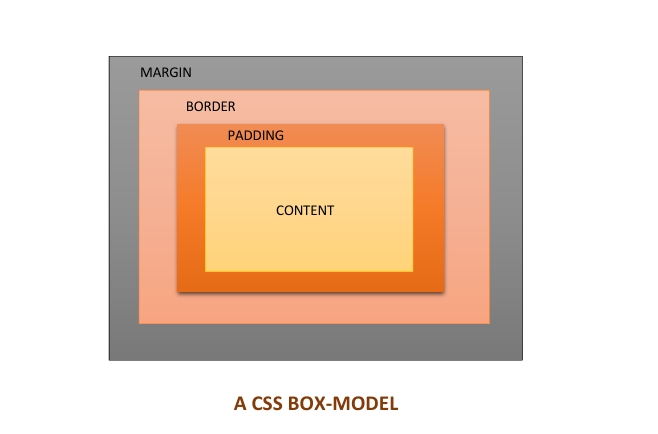

# CLASS 1_______ THE 2026 WEB ECOSYSTEM

## Theory
### Question 1

Understanding this process is important for a web developer because it helps in building faster and more efficient websites. If a developer knows how the browser renders a page, they can avoid unnecessary layout changes, reduce delays, and improve overall performance. It also makes debugging easier when elements appear in the wrong place or when a webpage feels slow and unresponsive.
### Question 2
QUIC is a technology that helps website load faster and work better on the internet. In older systems like TCP browser and a webpage have to exchange several messages before they can start sharing information. QUIC reduces these delays by combining some of the connection and the security steps into one faster process. For users in 2026, QUIC contributes to faster page loading and a better overall online experience.
### Question 3
As i'm doing research to know more on the advantages of QUIC over TCP, I came across this website ([cdnetworks](https://www.cdnetworks.com/blog/media-delivery/what-is-quic/)) using my phone, I wasn't able to read the content because some part of the content broke out of the screen, I switched to desktop site on my phone and the result was still the same. This prompted me to inspect the code using dev tools on my PC browser. There I discovered there was no semantic element used in the code it was all divs.

## Product thinking
### Question 1
Semantic elements acts like labels on a well-organized library. They help search engines quickly find and categorize your content making it easier to understand.
In the case of building a blog for a famous chef who wants more traffic, semantic element such as "header", "article", "main", and "aside" when combine with quality food content will help search engines understand the content better, this greatly enhance the chance of the blog appearing for relevant searches which in turn increases user traffic.
### Question 2
The edge-computing feature that's going to matter most when designing a real-time multi-player game is the faster-response time. Edge-computing solves the delay problems by processing data using a nearby server closer to the player rather than sending everything to a distant central server. This results in smoother game play, quicker reactions and swift multi-player experience.

## Engineering best practice
### Question 1
I disagree with the idea of using "div" elements everywhere, even if the website appears to work fine. semantic elements such as "header", "nav", "main", "article", and "footer" improve accessibility making the website easier for everyone to navigate. Secondly, semantic elements helps with SEO (Search Engine Optimization) which may improve how the site appears in search results. Thirdly, When returning to a project months later, it is much easier to understand what each section does if the tags describe their purpose instead of seeing dozens of "div" elements. Finally, when using semantic HTML elements, collaboration is made easier and other developers can quickly understand the layout and structure of the website without having to guess the purpose of each element.

# CLASS 2_______ TYPOGRAPHY AND INFORMATION HIERARCHY

## Theory
### Question 1
"em" tag lay emphasis on a word or phrase. it adds meaning to the content while >i< tag is mainly used to change the style(italicize) in order for it to look different from the surrounding text. I will use >em< tag when I want to place emphasis on a word or phrase, therefore adding meaning to the word or phrase. screen readers may also change their tones when reading the text making it more acessible to ordinary users and the visually impaired. for the >i< tag I'll use it to denote a foreign word, scientific name and technical terms e.t.c
A real example is in the following phrase; "If you ever found yourself in an ebira community, <em>never</em> use the word <i>weguh</i>". This laid an emphasis on the word 'never' and also shows that the word 'weguh' is a non-english word
### Question 2
Elements like >em<>, >strong<, >abbr< has specific screen reader behaviour. the >em< tag tells the screen reader to stress a word or phrase showing it's importance. the >strong< tag indicates that the content is highly important or urgent and screen readers often announces this with stronger emphasis or tone. >abbr< tag when provided with the full meaning using the 'title' attribute, the screen reader can read the full phrase instead of just the letters.
The browser handles them in such way to communicate effectively to users especially the visually impaired.
### Question 3
ARIA labels are special attributes that help screen readers describe elements on a webpage to users who cannot see the screen. for instance, if i should represent my search button with an icon, i had use an ARIA label to instruct the screen reader to read it as a search button, but if I build my button using div tag, it's better to change it to the correct semantic element rather than using ARIA labels.
## Acessibility Reflection
### Question 1
I tested the zenith bank website, I was able to navigate through the main menu using the tab key. the login form had placeholder for password and account number. the buttons showed a black border outline when selected with keyboard or when hovered with mouse, making it easy to know where I was on the page. there's option for voice output and the chatbot is readily available on the homepage.
## Product thinking
### Question 1
i will use H1 for my main heading which would be the name of the API. under the main heading i'll have sections using the H2 tag such as introduction, getting started and troubleshooting. inside those sections i'll use H3 tags for specific details. for example, under introduction, i'll use H3 tag to give a short description of the API. this will help the developers scan through it faster and navigate the page easily.

# Class 3_______Modern Assets and Linking

## Theory
### Question 1
first of all, i'll resize the image to the particular size needed on the website. then I'll convert it from png to a more modern format like WebP or AVIF. the reason for the conversion is that WebP and AVIF provide good image quality at a smaller size. I'll also test the image on different device to make sure of it quality and loading speed.
### Question 2
The srcset attribute allows a browser to choose the most suitable image size for a user's device. I'd use an srcset when my website is to be acessed by users with different screen size. 
imagine a scenario whereby a website uses a 1000px hero image for all devices. Mobile users would have to download this large image even though their screen size is small. this waste data and increase loading time. using srcset, the browser can deliver appropriate image sizes to appropriate users. this improves loading speed and reduces data usage.
### Question 3
rel="no opener" is used together with target="_blank" to improve the security of a webpage. it prevents the newly opened page from acessing or changing the original webpage. It's just like you opening the door for a visitor without giving them the keys to your house. this helps protect users from harmful websites and attacks.
## Engineering thinking
### Question 1
First of all, I will use lazy loading so that images are only loaded when the user scrolls near them. secondly, I will use modern image formats like AVIF to maximize image quality and minimize image size. thirdly, I will use a CDN (Content Delivery Network) to serve the images on multiple servers around the world, allowing users to download them from a nearby server. and finally, I'll use responsive image sizing to make sure that images are rendered in an appropriate size on different screens. 

# Class 4_______ Modern forms and User experience
## Theory
### Question 1
Client-side validation helps the user know immediately when they enter something incorrectly in a form. For example, if someone types an email without "@", the form can show an error before it is submitted. This saves time and makes the form easier to use. Server-side validation happens after the form has been submitted. It checks the data again to make sure it is valid and safe. I think I'll need both because client-side validation improves the user experience, while server-side validation helps protect the website from incorrect or harmful data.
### Question 2
The autocomplete attribute helps the browser remember and fill in information that a user has entered before. This makes forms faster to complete and reduces typing mistakes.
Some common values I'll use are:

NAME – used when asking for a user's full name during registration.

EMAIL – used for email address fields in signup or login forms.

TELEPHONE-NUMBER – used when collecting a phone number.

STREET-ADDRESS – used in delivery or shipping forms.

PASSWORD – used in login forms to help users fill in their passwords.

## Product thinking 
### Question 1
If I were building the form, I would make sure the user's progress is saved after each step. This way, if they lose their internet connection on step 4, they would not lose all the information they already entered. I would also show a message telling the user that the connection has been lost and that their progress has been saved. Once the internet is restored, they should be able to continue from the last completed step instead of starting the application again. I would also make sure that each step is checked before moving to the next one so that users can fix mistakes early. This would make the form easier and less frustrating to use.
### Question 2
I would use a native select element when I only need users to choose from a simple list of options. Examples include selecting a country, gender, department, or age range. Native selects are easy to create and work well on different devices. A custom dropdown would be useful when I need extra features that a normal select does not provide. For example, if users need to search through many options, display icons, or use a special design. In most cases, I would choose a native select because it is simpler and already works well. I would only use a custom dropdown when the project requires additional functionality.

## Engineering thinking
### Question 1
The password field will clearly tell users what is required before they create a password. For example, it will show a checklist that includes a minimum of 8 characters, one uppercase letter, one number, and one special symbol. As the user types, the checklist will update to show which requirements have been met. A strength meter will also indicate whether the password is weak, medium, or strong. There will be a button that allows users to show or hide the password so they can check what they typed. The button will be easy to use with both a mouse and a keyboard. all instructions will be clearly written to aid screen readers.

# Class 5_______ The CSS Engine-- Box Model and Specificity
## Theory
### Question 1

If one div has margin-bottom: 20px and the next div has margin-top: 30px, the space between them will be 30px, not 50px. this happens because of margin collapsing. when vertical margins touch each other the browser uses only the larger margin value instead of adding them together.
### Question 2
CSS specificity helps the browser decide which style should be applied when multiple styles target the same element. Generally, IDs have the highest priority, followed by classes, and then element selectors.
Calculating specificity:

.header nav ul li a = 1 class + 4 elements 

nav a.active = 1 class + 2 elements

.nav-links a = 1 class + 1 element 

Since all three selectors have one class, we compare the number of element selectors. The first selector has the highest value.
Therefore, .header nav ul li a would win because it is more specific than the other two selectors.
### Question 3
The cascade is the process the browser uses to decide which CSS rule should be applied when multiple rules affect the same element. It takes into account things such as specificity, source order, and importance. Understanding the cascade can save a developer from writing unnecessary CSS. For example, if a button is already receiving a style from a parent, there is no need to create any extra rules. Instead, I can check which rule is being applied and adjust it correctly. This keeps the code cleaner and easier to maintain.